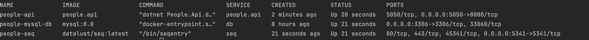
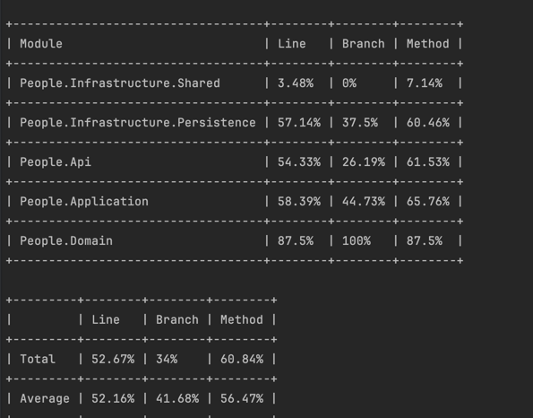
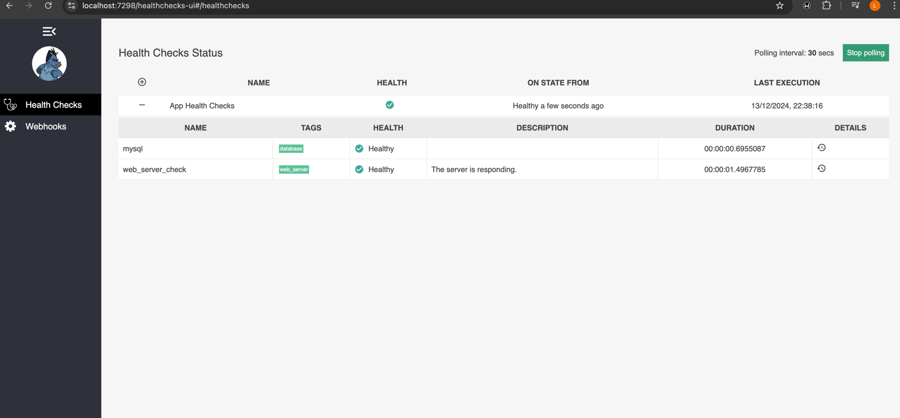
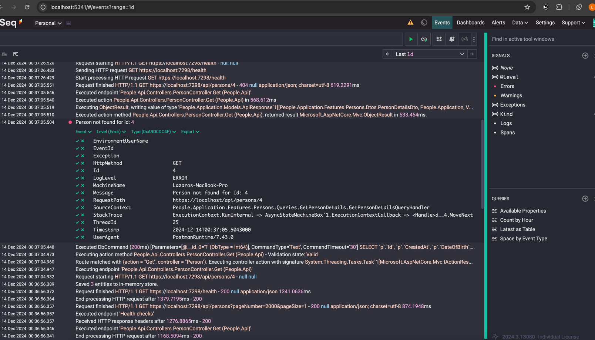

# Proyecto People API

Este proyecto contiene una API de .NET que se ejecuta con Docker y se conecta a una base de datos MySQL. A continuación se describen los pasos para clonar el repositorio y ejecutar los contenedores en un entorno de **producción**.

## Requisitos previos

Antes de comenzar, asegúrate de tener instalados los siguientes programas:

- **Docker**: [Instrucciones de instalación de Docker](https://docs.docker.com/get-docker/)
- **Docker Compose**: [Instrucciones de instalación de Docker Compose](https://docs.docker.com/compose/install/)

## Pasos para ejecutar el contenedor en producción

### 1. Clonar el repositorio

Primero, clona el repositorio en tu máquina local:

```bash
git clone https://github.com/lazarok/PeopleApi.git
cd PeopleApi
```

### 2. Construir las imágenes y ejecutar los contenedores. Docker Compose v2 (sin guion)

```bash
docker compose up --build -d
```

### 3. Verificar que los contenedores están corriendo

```bash
docker compose ps
```



### 4. Acceder a la API

#### Abre tu navegador web y navega a http://localhost:5050/swagger para acceder a la API.

### 5. Detener los contenedores

```bash
docker compose down
```


#### Nota
Se utiliza la implementación `FileSystemStorageService` para la gestión de archivos en el sistema, la cual está ubicada bajo el namespace `People.Infrastructure.Shared.Storage`. Esta implementación permite almacenar los archivos localmente en el sistema de archivos.

Además, el sistema define una abstracción a través de la interfaz `IStorageService` en el namespace `People.Application.Services`, la cual tiene dos implementaciones:

- **FileSystemStorageService**: Gestión de archivos en el sistema de archivos local.
- **S3StorageService (NO PROBADO)**: Gestión de archivos utilizando almacenamiento en Amazon S3.

Ambas implementaciones permiten intercambiar la estrategia de almacenamiento sin modificar la lógica de negocio, facilitando la configuración y escalabilidad del sistema.


#
## Ejecutar Pruebas Unitarias

Ir al directorio
```bash
$ ls
```

```
PeopleBackend.sln                       README.md                               docs                                    tests
docker-compose.yml                      src
```

#### Ejecutar pruebas con covertura de código

```bash
dotnet test /p:CollectCoverage=true
```



#### Health Checks

Abre tu navegador web y navega a http://localhost:5050/healthchecks-ui





#### Seq. Monitoreo | Registro de Eventos

Abre tu navegador web y navega a http://localhost:5341/





#### Ejecutar proyecto local

Crea los siguientes contendores de docker

```bash
docker run --name  local-mysql -e MYSQL_ROOT_PASSWORD=P@ssword! -d -p 3306:3306 mysql:8.0
```

```bash
docker run --name local-seq -e ACCEPT_EULA=Y -p 5341:80 datalust/seq
```
Ejcuta el proyecto por la URL https://localhost:7298