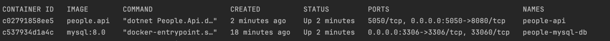

# Proyecto People API

Este proyecto contiene una API de .NET que se ejecuta con Docker y se conecta a una base de datos MySQL. A continuación se describen los pasos para clonar el repositorio y ejecutar los contenedores en un entorno de **producción**.

## Requisitos previos

Antes de comenzar, asegúrate de tener instalados los siguientes programas:

- **Docker**: [Instrucciones de instalación de Docker](https://docs.docker.com/get-docker/)
- **Docker Compose**: [Instrucciones de instalación de Docker Compose](https://docs.docker.com/compose/install/)

## Pasos para ejecutar el contenedor en producción

### 1. Clonar el repositorio

Primero, clona el repositorio en tu máquina local:

```bash
git clone https://github.com/lazarok/PeopleApi.git
cd PeopleApi
```

### 2. Construir las imágenes y ejecutar los contenedores. Docker Compose v2 (sin guion)

```bash
docker compose up --build -d
```

### 3. Verificar que los contenedores están corriendo

```bash
docker compose ps
```



### 4. Acceder a la API

#### Abre tu navegador web y navega a http://localhost:5050/swagger para acceder a la API.

### 5. Detener los contenedores

```bash
docker compose down
```
